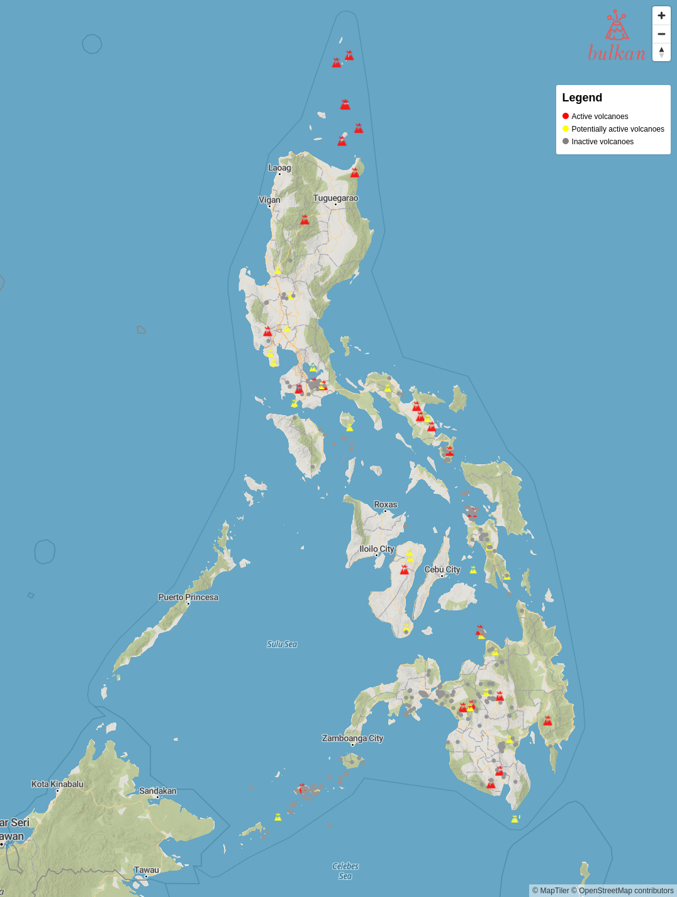

   
  

# About

> búlkan - Filipino word for volcano.

[Interactive map](https://bulkan.vercel.app) for volcanoes in the Philippines.

The full dataset is hosted in the [phl-volcanoes](https://github.com/j4ckofalltrades/phl-volcanoes) repo.

## Development

View the interactive map locally by running `make init && make start`

